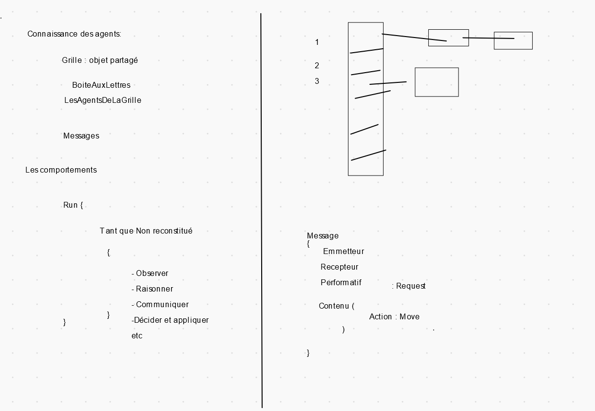
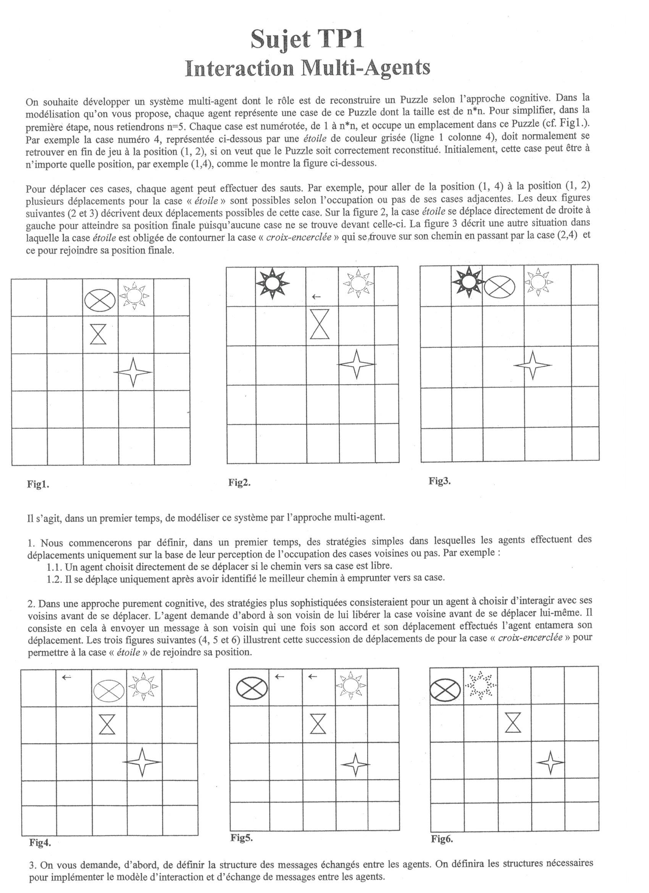

# TP interaction SMA
## Infos
* On ne compte pas le mouvement
* On essaye de minimiser les mouvements (on fait des demandes de déplacement à d'autre pièce pour pouvoir minimiser ses mouvements dans le cas ou la pièce refus, la pièce principale va essayer de la com )
* Le gain est uniquement global se qui force les pièces satisfaites à quand même se déplacer pour que tous le monde soit satisfait.
* La grille n'a pas de comportement intelligent
* Lors de l'envoie d'un message on envoie sa position de départ et celle où l'on souhaite arriver. Vu que nous somme en parallèle, la pièce gênante peut avoir bouger, c'est pour ça que l'on fournit la position de départ.
* On n'impose pas via message le déplacement d'un autre agent
* Fonctionne jusqu'à +-90% de la grille, record avec 25 case contenant un case vide.

### Etape 1
* Faire des action simples
* on met en place des simple demandes pas de négociation

### Etape 2
* minimiser le nombre de déplacement
* augmenter le nombre d'agent dans la grille

### Rendu

* La qualité est important pour le rendu

Rapport : indiquer se qui marche et ce qui ne marche pas
Prendre un exemple et faire des captures d'écrans pour expliquer étape par étape

## Les agents
Les agents ont une vision global du plateau
Les agent agissent directement sur la map représentant
Les agents doivent être en multi threading, on verrouille les cases (mutex,)

## Plusieurs manières de résolution
* Ligne par ligne(jusqu'à n-2 ^peu t'être) puis colonne par colonne 
    pas de hiérarchie mais plutôt si un agent demande à un autre agent de se déplacer, l'agent sollicité regarde si sa ligne est fini et si oui refuse de bouger.
* Bordure puis on réduit etc -> phénomène de zoom
* En spiral

## Notes de Richou
1. Eviter les mouvements qui augmente la distance de Manhatthan.
2. Ne pas bouger quelqu'un bien placé dans un coin. Jamais (sauf sur une grille 2x2)
3. Si deux mouvement possible avec la même distance de Manhatthan :
    - Un seul est libre ? (ou exclusif : ^) -> On y va
    - Deux libres ou deux bloqués : Random pour connaitre la destination
4. Deux niveaux de requêtes : 
    - Bouge stp : (Si il répond non, on cherche une autre solution)
    - Dégage : (Il n'y a pas d'autre solution)
5. Si B demande à A de bouger et que A accepte, B se met en attente mais peut bouger si une place aussi intéressante ou mieux se libère. 
6. Monotonic Concession Protocol (diapo 41)
7. Etape d'une négociation : 
    - Cadrer la négociation
        - Initier la négociation
        - Apporter les informations requises sur le contexte
        - Fixer l'objectif de la négociation 
        - Décider de la méthode
    - Analyser les infos sur les objectifs spécifiques
    - Entamer la négociation
    - Terminer la négociation
8. Intérêt commun : Réussir le taquin
9. Négociation bi-latéral pour bouger
10. Négociation multi-latéral pour une place libre
    - Enchère : Compteur de génance. Si égalité ?
        - Sa propre génance = 2 (Permet de différencier avec les personnes bien placé mais qui doivent bouger.)
    - Si enchère : Qui est le commissaire ?
11. En cas de besoin de commissaire ou manager -> Celui qui entame l'échange ou la discussion. 
