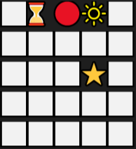
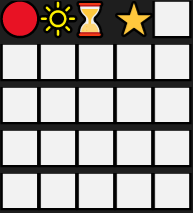
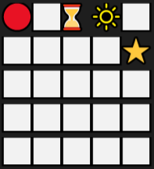
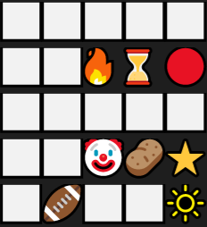
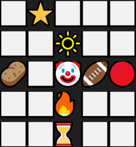

## Modélisation du système multi-agent

Nous avons choisi de modéliser notre SMA avec deux classes :

- L'environnement, qui contrôle l'état de la grille
- L'agent, qui doit se déplacer dans le taquin pour atteindre son but, aussi appelé la case dans l'énoncé.

## Réalisation d'un taquin simplifié 

Dans un premier temps, nous avions réalisé une version simplifié du taquin en multi-threading. Pour cela, nous avions implémenté un agent dans le fichier [`src/agent.py`](https://github.com/pi-aire/SMA-Interaction/blob/main/src/agent.py) qui cherche uniquement à rejoindre son but. Nous avions suivi le modèle décrit ci-dessus afin de voir si le modèle était bon et ce qui devait être amélioré. Dans le cas de l'exemple de l'énoncé l'exécution s'est déroulé comme prévu. Nous avons cherché à créer un conflit entre les agent pour voir leur comportement. Ci-dessous, la configuration initiale : 

{width=20%}

Avec pour objectif, la situation de l'énoncé : 

{width=20%}

Notre résultat est le suivant : 

{width=20%}

On constate que le conflit initiale qui opposait le sablier au point rouge n'a pas été résolu. Il est aisé de déduire que le programme s'est arrêté dans cette configuration car les agents sont restés coincés sur leur position. 

En revanche, nous pouvons en conclure que notre modélisation du SMA semble pertinente, nous allons faire communiquer les agents entre eux afin qu'ils puissent signaler quand un agent bloque leur passage.

## Les threads

Nous avons implémenté de façon à ce que chaque agent s'exécute dans son propre thread. Cela apporte différentes contraintes. Nous avons utilisé un `barrier` au début de chaque thread afin de s'assurer que les agents commencent à agir tous en même temps. Nous avons également été contraint d'utiliser cela après un cycle perception/action pour s'assurer qu'il n'y a pas de décalage entre les agents. Nous avions sans cela, dans certain cas, un agent qui pouvait réaliser 1000 tours alors qu'un autre n'en réalisait qu'un.

## Gestion de la priorité

Nous avons fixé une priorité à nos agents. De ce fait, un agent ne peux envoyer un message pour demander un déplacement uniquement à des agents de priorité inférieur. Le niveau de priorité est fixé en fonction de la position finale de l'agent. La priorité décroit suivant les lignes et à l'intérieur d'une ligne elle décroit suivant les colonnes. L'agent (0,0) est plus prioritaire que l'agent (O,n) qui est plus prioritaire que l'agent (1,0).

## Les messages

Afin de résoudre le problème de blocage soulevé précédemment, nous avons implémenté un agent 2, qui peut communiquer. L'implémentation est disponible dans le fichier [`src/agent2.py`](https://github.com/pi-aire/SMA-Interaction/blob/main/src/agent2.py).

### Type des messages 

Nous avions défini différents types de messages :

- `Request` : Qui demande à l'agent destinataire quelque chose
- `Informative` : Pour informer le destinataire

A l'usage, nous nous sommes rendu compte que pour l'agent 2, il n'était pas nécessaire d'avoir différents types puisque seul la requête est utilisée. En réalité, il aurait judicieux pour un agent plus évolué d'utiliser l'informative afin d'informer un agent que la demande est acceptée, refusée ou en considération. 

### Contenu des messages

Dans le fichier `src/agent2.py` nous avons créé une classe `Content` qui décrit le contenu d'un message. Pour l'agent 2, qui communique de façon simplifiée, le contenu du message repose sur deux attributs:
- `pSender`: Pour la position de l'envoyeur au moment de l'écriture du message
- `pReceiver`: Pour la position du receveur au moment de l'écriture du message

Ces attributs nous permettent de déterminer si la requête est toujours d'actualité ou si elle est obsolète.

### Expédition des messages 

Notre agent cherchera en premier à se déplacer sur une case libre, si elle améliore sa distance de Manhattan pour atteindre son but. Si l'agent n'est pas libre et qu'il n'a pas atteint son objectif, il enverra alors un message à son voisin, qui améliore le plus sa distance de Manhattan mais également d'une priorité inférieure à la sienne, dans l'espoir que l'agent bloquant se déplace et que l'agent envoyeur prenne sa place. On empêche un agent d'envoyer un message de déplacement à un agent de priorité supérieur pour mettre en place une résolution à l'aide d'une heuristique consistant à placer les agents des lignes supérieurs en premier.

### Lecture des messages

Avant de choisir si notre agent va se déplacer ou non, il regarde s'il a des messages lui demandant de se déplacer. Si c'est le cas, il enregistre l'information dans un booléen `needToMove`. Ensuite, l'agent prend la décision de se déplacer, même si cela augmente sa distance de Manhattan par rapport à son objectif.

Comme dit précédemment, à la lecture du message, nous vérifions si celui-ci est toujours d'actualité.

Lorsqu'un agent reçoit l'ordre de se déplacer, si il ne peut pas le faire, il demande à un autre agent de se déplacer, en ne le demandant pas à l'expéditeur, afin de laisser sa place comme demandé.

## Agent 2

Notre agent 2, l'agent communiquant, se satisfait et ne bouge plus si il a atteint son but et que l'ensemble des agents avec une priorité supérieure est bien placé. 

Si nous reprenons la situation ci-dessus, avec le même but mais que les agents implémenté sont issues de l'agent 2, nous arrivons dans la configuration suivante : 

{width=20%}

On constate aisément que les problèmes de conflit ont pu être résolu à l'aide de la communication. 

Fort de cette réussite, nous avons augmenté la difficulté du problème en plaçant plus d'agent sur la grille. La configuration initiale est la suivante : 

{width=20%}

Avec pour objectif, la configuration suivante : 

{width=20%}

Après l'exécution du programme on constate qu'un agent s'est retrouvé coincé. L'agent symbolisé par la flamme, est de priorité inférieure que les agents l'empêchant d'atteindre son but. C'est pour cela qu'il se retrouve isolé dans cette partie de la grille. Dans la présentation de l'agent 3, nous avons trouvé une résolution à ce problème.

Pour la sélection d'un mouvement, quand plusieurs sont possible avec le même niveau d'efficacité, nous mélangeons la liste des mouvements possible afin d'ajouter une part d'aléatoire.

## Agent 3 - En cours d'implémentation

Une fois l'implémentation de l'agent 2 réalisée, nous nous sommes penchés sur la réalisation d'un [agent 3](https://github.com/pi-aire/SMA-Interaction/blob/main/src/agent3.py) avec un système de communication et de discussion plus élaborée. Lorsqu'un premier agent, appelons le A, demande à un deuxième agent, B, de se déplacer, si B ne peut pas se déplacer, lors de sa demande à un troisième agent, celle-ci tiendra compte de la demande de A, mais également de la demande de B. Ainsi, l'importance de la demande est croissante. Evidement, comme lors de l'agent 2, une vérification pour savoir si la requête est toujours d'actualité aura lieu. 

Dans le cas où un agent est bloqué dans une zone encerclé par des voisins d'une priorité supérieure, par exemple dans un angle, l'agent peut temporairement augmenté son importance afin de sortir de cette zone de conflit. 

## Agent 4 (Eco Solving Problem)

Une approche que nous aurions aimé implementer était à l'aide d'un ESP, un modèle d'implémentation que nous avons eu l'occasion d'aborder dans un autre TP de SMA. 